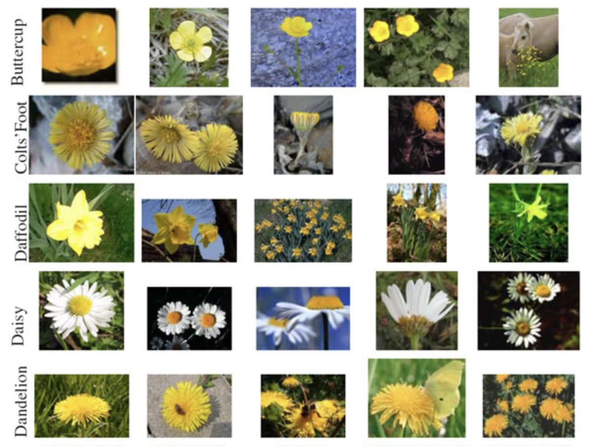
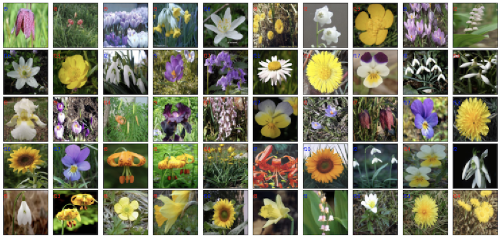

# COMP3340_Group16_GP 🏆

### **Connecting low-level image processing and high-level vision for degraded image classification**

### 📋Progress:

**Project Proposal** on Sep 16: [proposal](https://github.com/SUcy6/COMP3340_GP/blob/main/COMP3340_Group%2016_Proposal.pdf)

**Midterm Report** on Oct 30:

To test baseline CNN on degraded images - [Robustness_on_CIFAR100-C_CIFAR10-C](https://github.com/shaktiwadekar9/Robustness_on_CIFAR100-C_CIFAR10-C)

Results on degraded imageset CIFAR100-C are [here](https://github.com/SUcy6/COMP3340_GP/tree/main/cifar100-C_results)

**Final presentation slides**:

**Final report**:

## 📊Datasets

[17 Category Flower Dataset](https://www.robots.ox.ac.uk/~vgg/data/flowers/17/): a 17 category flower dataset with 80 images for each class

[Benchmarking Neural Network Robustness to Common Corruptions and Perturbations](https://github.com/hendrycks/robustness): Tiny ImageNet-C, CIFAR-10-C

### Data Prepare

**For Oxford flower17:**

1. Download the images from [17 Category Flower Dataset](https://www.robots.ox.ac.uk/~vgg/data/flowers/17/)
2. Extract the file and get a **jpg** folder with all the 1360 images
3. Build a new data folder containing **17 subfolders** (for categories 1 to 17)
4. separate and distribute the images to the **17 subfolders** (each 80 images is one category in Flower17)

flowers.csv: a helper csv file for distribute the images

**For degraded images:**

Tensorflow dataset [cifar10_corrupted](https://www.tensorflow.org/datasets/catalog/cifar10_corrupted)

## 📌Experiment Result

We output the training loss, validation loss, and test accuracy to csv file. From these files, we plot the graphs to visualize our experiment results.

All the output csv can be found [here](https://github.com/SUcy6/COMP3340_GP/tree/main/output).

## 🏠Model Architecture

The detailed model architecture and training process can be found [here](https://github.com/SUcy6/COMP3340_GP/tree/main/Model).

To reproduce our experiment results, please download the jupyter notebooks and train on your cloud with GPU.

## 🌗Low-quality image classification

In the second part of our project, we decide to test the baseline models on degraded image dataset. After that, we will try to implement the newly proposed method for low-quality image classification. They successfully combine low-level image processing with high level classification task.

****Dirty Pixels: Towards End-to-End Image Processing and Perception****

[https://github.com/princeton-computational-imaging/DirtyPixels](https://github.com/princeton-computational-imaging/DirtyPixels)

**WaveCNet: Wavelet Integrated CNNs to Suppress Aliasing Effect for Noise-Robust Image Classification**

[https://github.com/LiQiufu/WaveCNet](https://github.com/LiQiufu/WaveCNet)

[https://paperswithcode.com/paper/wavecnet-wavelet-integrated-cnns-to-suppress](https://paperswithcode.com/paper/wavecnet-wavelet-integrated-cnns-to-suppress)

:point_right:**Group-wise Inhibition based Feature Regularization for Robust Classification**
# more state-of-art, but more complex

[https://paperswithcode.com/paper/group-wise-inhibition-based-feature](https://paperswithcode.com/paper/group-wise-inhibition-based-feature)

[https://github.com/LinusWu/TENET_Training](https://github.com/LinusWu/TENET_Training)

****Robust Image Classification Using A Low-Pass Activation Function and DCT Augmentation****

[https://github.com/tahmid0007/Low_Pass_ReLU](https://github.com/tahmid0007/Low_Pass_ReLU)

:point_right:**When Image Denoising Meets High-Level Vision Tasks: A Deep Learning Approach**
# this one is easier to explain and understand

[https://arxiv.org/pdf/1706.04284.pdf](https://arxiv.org/pdf/1706.04284.pdf)

[https://github.com/Ding-Liu/DeepDenoising](https://github.com/Ding-Liu/DeepDenoising)

## 🗓️Midterm Plan

- Build the baseline models
- training
- Test and evaluate models(plot accuracy/loss, test result)
- Report writting (further explanation)

## 📝Final Plan

- [ ] Confirm that baseline CNNs fail when using degraded images (e.g. noise, blur)
- [ ] training a model that combine low level and high level tasks (DeepDenosing or GroupWise)
- [ ] Test and evaluate models(plot accuracy/loss, test result)
- [ ] Presentation prepare (Intro, baseline models, limits of baseline, newly proposed model, results analysis)

## 🤡Tutorials

[alexnet on celeba](https://www.youtube.com/watch?v=6c8WFGbPHpE)

[resnet from scratch](https://www.youtube.com/watch?v=DkNIBBBvcPs)

[pytorch pretrained models](https://www.youtube.com/watch?v=qaDe0qQZ5AQ&t=14s)

[finetuning pytorch pretrained](https://pytorch.org/tutorials/beginner/finetuning_torchvision_models_tutorial.html)
